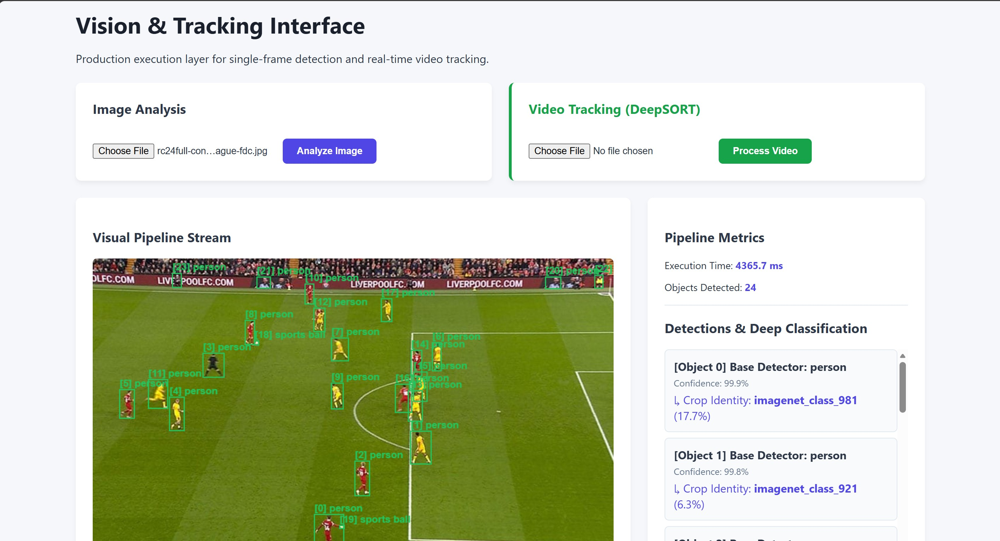

# Production Vision Pipeline: Detection, Classification & Tracking 🚀

[](https://python.org)
[](https://fastapi.tiangolo.com)
[](https://pytorch.org)
[](https://github.com/levan92/deep_sort_realtime)

A robust, end-to-end computer vision microservice designed for production environments. This project bridges the gap between raw machine learning models and deployable software by chaining **Mask R-CNN**, **ConvNeXt**, and **DeepSORT** together via strict Pydantic data contracts and an asynchronous HTTP serving layer.



## 🧠 System Architecture

Individual models are useful, but vision products are chains of models. This pipeline utilizes a **Detect → Track → Classify** architecture to maximize GPU/CPU efficiency. 

Instead of classifying every object in every frame, the system uses DeepSORT as a temporal filter. It tracks detected bounding boxes across frames and only runs the heavy classification head (ConvNeXt) when a uniquely identified track appears for the first time, safely caching the result.

### Core Components
* **Base Detector:** Mask R-CNN (ResNet50 FPN v2) filters the frame for high-confidence object proposals.
* **Tracker:** DeepSORT (Real-time) assigns persistent IDs to objects across sequential video frames.
* **Deep Classifier:** ConvNeXt-Tiny executes cropped regional classification on newly established tracks.
* **Data Contracts:** Pydantic strictly types all boundaries, turning silent coordinate drift into loud, catchable validation errors.
* **Serving Layer:** FastAPI provides a non-blocking REST API with background task queues for long-running video jobs.

## ✨ Key Features

* **Dual-Mode Inference:** Supports low-latency single-frame image analysis and deep temporal video tracking.
* **Asynchronous Polling:** Video processing is handed off to background threads. The client UI polls a `/status` endpoint to report live FPS and frame progress without hitting browser timeout limits.
* **Persistent State Saving:** Pipeline metrics (latency, active tracks, FPS) and serialized model weights are periodically checkpointed to disk.
* **HTML5 Dashboard:** A lightweight, vanilla JS frontend utilizing `<canvas>` for live bounding box rendering and `<video>` for H.264 result playback.

## 📁 Project Structure

```text
├── pipeline.py         # Core inference engine (Preprocessing, Detect, Track, Classify)
├── schemas.py          # Pydantic data contracts enforcing strictly typed IO
├── main.py             # FastAPI server, route handlers, and background task logic
├── benchmark.py        # Profiling script to identify latency bottlenecks
├── test_video.py       # Headless test script for bypassing HTTP timeouts
├── requirements.txt    # Frozen environment dependencies
└── static/
    ├── index.html      # Production web dashboard
    └── videos/         # Local volume for video I/O caching
```

## 🚀 Getting Started

### 1. Environment Setup
Create a clean Python environment and install the required dependencies:
```bash
python -m venv vision-env
source vision-env/bin/activate  # Windows: vision-env\Scripts\activate
pip install -r requirements.txt
```

### 2. Launch the Service
Start the FastAPI server via Uvicorn. Models will be loaded into system memory during the startup event.
```bash
uvicorn main:app --host 0.0.0.0 --port 8000
```

### 3. Access the Dashboard
Navigate to `http://localhost:8000` in your web browser to access the visual interface, upload media, and view real-time inference results.

## 📡 API Reference

### `POST /detect`
Accepts a static image and returns deeply classified bounding boxes.
```bash
curl -X POST -F "file=@sample.jpg" http://localhost:8000/detect
```

### `POST /start-tracking`
Uploads a video and kicks off a background DeepSORT tracking job. Returns a unique `job_id`.
```bash
curl -X POST -F "file=@traffic.mp4" http://localhost:8000/start-tracking
```

### `GET /status/{job_id}`
Used to poll the live status, frame progress, and FPS of an active video tracking job.

## 📊 Benchmarking & Telemetry

Profiling is built directly into the engine. Run `python benchmark.py` to simulate traffic and generate a `p50` and `p95` latency report for each distinct stage of the pipeline (Preprocessing, Detection, Classification). 

Telemetry history is automatically serialized to `checkpoints/metrics_history.json`.

---
*Built as a capstone demonstration of production machine learning engineering.*